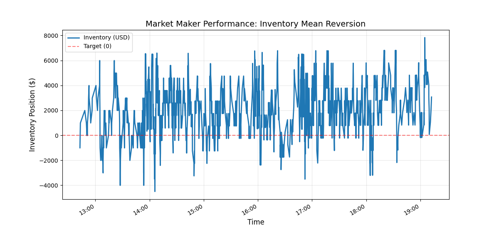

# Deribit Market Making Bot (Asyncio)

A Python based high-frequency market making bot tested on Deribit Tesnet BTC perpetual futures market.

* Figure 1: real-time performance showing inventory mean reversion. 

## Key Features
* **Inventory Risk Management:** Linear inventory skewing to adjust quotes based on current holdings.
* **Asynchronous Architecture:** Use of 'asyncio' and 'ccxt' for non-blocking I/O and low latency order management.
* **Execution Safety:** Utilizes `Post-Only` limit orders to ensure maker rebates.
* **Trade Persistence:** Logs all executions to a local SQLite database for audit trails.

## Strategy Logic
The bot calculates a fair price based on the order book mid-price, then skews the bid/ask spread based on the current inventory:
`Target Bid = Mid * (1 - Spread) - (Inventory * Skew_Factor)`

## Tech Stack
* Python 3.10+
* ccxt (Async Support)
* SQLite3
* Pandas, Matplotlib